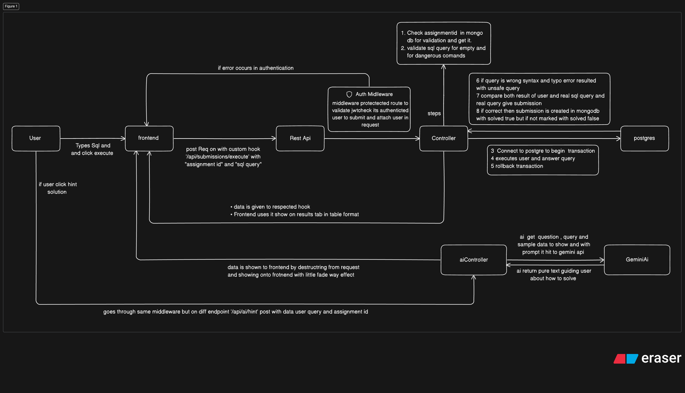

#Site Live Link 
https://sqlstudio.vercel.app/


# SQL Studio - 

- Write and run SQL queries in a code editor
- See your query results in a nice table format
- Get ai hints when you are stuck . 
- Create an account and start learning . 


# Setup 

Node js must be installed on system.

# Step 1: Clone the Project

```bash
git clone <your-repo-url>
```

# Step 2: Setup the Backend

This is the part that handles all the logic behind the scenes:

```bash
cd backend
npm install
```

After installing, you need to create a `.env` file you can copy from `.env.example` and put all those mention env secrets.

```bash
npm run dev
```

 when you see "Server is running on port 5000" and "MongoDB Connected" - that means it's working

# Step 3: Setup the Frontend 

From root sqlStudio folder

```bash
cd /frontend  
npm install
```

After installing, you need to create a `.env` file you can copy from `.env.example` and put all those mention env secrets.

To start the frontend:

```bash
npm run dev
```

Now open your browser and go to `http://localhost:5173` - you should see the app!


# How to Get These Services:

1. *MongoDB Atlas* - Go to mongodb.com, create free account, make a cluster, get the connection string
2. *PostgreSQL* - use a free cloud service like Neon or Supabase and get connection string . 
3. *Gemini API* - Get from Google AI Studio (there's a free tier!)

## Technology Choices 


### Frontend Technologies:

*React 19*
*TypeScript*
*Vite*
*SCSS/SASS*
*Monaco Editor* 
*React Router*
*Axios*

### Backend Technologies:

*Express.js*
*Node.js*
*MongoDB with Mongoose*
*PostgreSQL*
*JSON Web Token(JWT)*
*Bcryptjs*
*Nodemailer*
*Google Gemini AI*


# How to Use the App

1. *Sign Up* - Create an account
2. *Login* - Use your credentials
3. *Dashboard* - See your assignments solved and unsolved
4. *Solve* - click solve challenge to Go to the SQL editor, write queries, run them!
5. *AI Help* - Stuck on a problem? Click the AI button for hints


# Resources That Helped Me

- React and typescript tutorials 
- YouTube tutorials for scss (i know vanialla css but to know about format of scss)
- Gemini for enhancing solution and debugging





